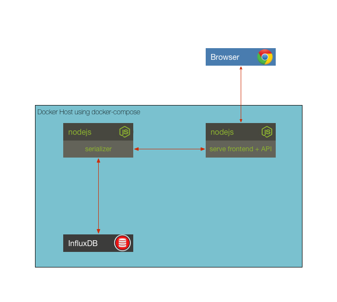

## Solution to Challenge 4

1. InfluxDB can be started with the run script `./influx/run.sh`
2. The serializer can be started with the run script `cd serializer && ./run.sh`
3. Start the frontend with the correct environment variables

  ```sh
SERIALIZER_HOST=localhost SERIALIZER_PORT=10000 PORT=10001 node .
  ```
4. Point your browser to [http://localhost:10001/]() to see the chart.
5. Write data to the serializer using the `serializer/testWrite.sh` script.


## Challenge 6



The number of shell sessions to run our 3 processes is quickly getting out-of-hand. For this challenge `Dockerfile`'s have been added both the `serializer` and `frontend` folders. Docker-compose makes managing and linking the various containers easier. For this challenge, use `docker-compose` to build and run the containers. There is a `docker-compose.yml` file for your convenience


__hint__ read about the [`docker-compose up`](https://docs.docker.com/compose/reference/up/) command


## Next Up: [Challenge 7](../challenge7/README.md)
